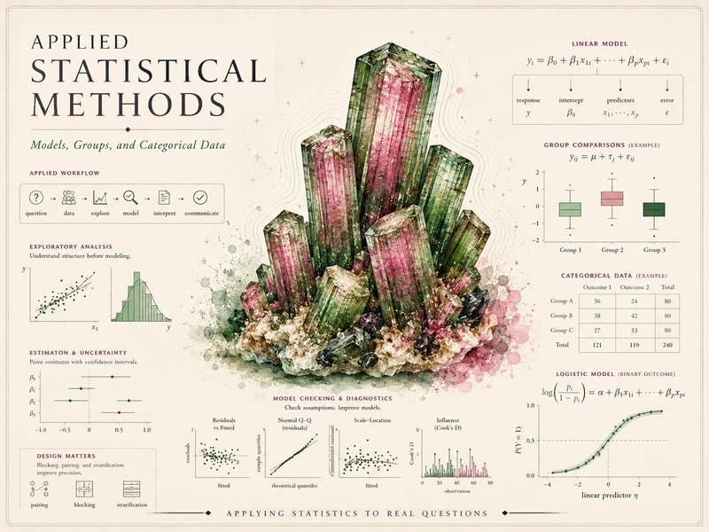

{srcset="assets/hero-web-800.webp 800w, assets/hero-web.webp 1400w" sizes="(min-width: 992px) 760px, 92vw" .course-hero-img fig-alt="Course identity hero for Applied Statistical Methods — a pink-and-green watermelon-tourmaline crystal cluster surrounded by applied-statistics graphics including a linear-model equation, group comparisons and one-way and two-way ANOVA, regression with residual diagnostics, a contingency table, and a logistic-regression curve, with the course title."}

# Applied Statistical Methods {.course-landing-title}

::: {.course-landing-subtitle}
Choosing, running, interpreting, and communicating common applied analyses — responsibly
:::

> A statistical method is not a button to press or a name to memorize. It is a way to connect a **question**, a
> **data structure**, a set of **assumptions**, an **estimate**, its **uncertainty**, and an honest
> **conclusion**. This course studies the common applied analyses — paired and two-group comparisons, ANOVA,
> two-way ANOVA, ANCOVA, regression, contingency tables, and logistic regression — as connected expressions of
> that single idea, and asks on every page what the method estimates, what it assumes, and what it cannot support.

## What this course is

This is a course about **using statistical methods to answer practical questions with real data**. It sits
between an introductory statistics course and the more specialized courses in modeling, design, inference,
Bayesian statistics, or resampling. Introductory ideas — descriptive summaries, the normal model, a single
one-sample $t$-test, the mechanics of one confidence interval — are *assumed background*, not the subject. The
subject is choosing and connecting a method to a data structure across **groups, factors, covariates, and
categorical outcomes**, then reading what the model estimates and reporting it without overstating it.

The signature discipline, returned to on page after page, is the **analysis blueprint** — six steps walked for
every method:

1. **Question** — are we comparing, explaining, or predicting?
2. **Structure** — the unit of analysis; the response versus the explanatory variable, grouping factor, or
   covariate; the outcome type (quantitative, categorical, binary); the design (paired versus independent, one
   factor versus two, observational versus experimental).
3. **Method** — the analysis that matches that structure, and why this one and not a neighbor.
4. **Assumptions & diagnostics** — what the method assumes, and how you check it.
5. **Estimate & uncertainty** — what the model *estimates* (a mean difference, an effect size, a slope, an odds
   ratio), reported **with a confidence interval, never as a bare p-value**.
6. **Conclusion** — statistical versus **practical** significance; **association versus causation**; what the
   analysis can and cannot support.

Two disciplines run *inside* the blueprint and recur on every page. The first is **report the estimate, not just
a verdict**: give an effect size and an interval, never a lone p-value. The second is **keep statistical
significance, practical significance, and a causal claim distinct** — observational data buy association, not
causation. You will see both named explicitly, every time.

To keep the course pointed at that target, it is deliberately **not** four other things, and every page resists
all four drifts:

- **Not a generic intro-statistics course.** The normal model and a single confidence interval are background;
  the work is connecting a method to a structure across groups, factors, covariates, and categorical outcomes.
- **Not a pure R / software course.** R and Quarto *carry out* the fit and produce the output, but the method's
  logic — what is compared, what is assumed, what is estimated, what can be concluded — stays central. The code
  is the means; the method is the message.
- **Not a formula-only methods course.** The point is never to memorize a test statistic or its sampling
  distribution. It is to map **question → structure → method → estimate → conclusion** and to read real output.
- **Not a disconnected catalog of named tests.** The paired $t$, the two-sample $t$, one-way ANOVA, two-way
  ANOVA, ANCOVA, regression, chi-square, and logistic regression are not a box of "use this when…". They are
  connected expressions of one blueprint, and the course threads that blueprint through every method.

## What you will be able to do

By the end of the term, you should be able to:

- Take a practical question and identify its **structure** — the unit of analysis, the response and its type, the
  role of each other variable, and the design — before choosing any method.
- **Explore and compare** data graphically and numerically, and judge whether a difference is large enough to
  matter, not merely large enough to be "significant."
- Carry out and interpret **one-sample and paired comparisons**, and explain why a paired design removes
  between-unit variation that an independent-samples analysis cannot.
- Carry out and interpret **two-group comparisons**, choose between pooled and Welch procedures, and report a
  difference with its confidence interval and an effect size.
- Fit and read **one-way ANOVA**, check its **assumptions and diagnostics**, and use **multiple-comparison**
  control and **planned contrasts** so you do not inflate the error rate.
- Fit and read **two-way ANOVA**, and recognize when an **interaction** makes a main effect conditional and must
  be read first.
- Fit and interpret **simple and multiple regression**, read a **partial (adjusted) slope**, check residuals and
  influence, and use **ANCOVA** to compare group means adjusted for a covariate.
- Analyze **categorical outcomes** with contingency tables and chi-square, and report **risk differences,
  relative risks, and odds ratios** with their meaning.
- Fit and interpret **logistic regression** for a binary outcome, exponentiate a coefficient to an **odds ratio**,
  and read a **predicted probability** rather than a raw logit.
- Write up any of these analyses as a clear, honestly-bounded report — estimate with uncertainty, diagnostics,
  and a conclusion that separates statistical significance, practical importance, and causation.

## How the site is organized

This public site has three working areas, reachable from the sidebar:

- **Notes** — the weekly instructional spine. Each week poses a question, develops the method, walks it through
  the blueprint on a recurring dataset, names a common applied-methods mistake, and offers ungraded self-checks.
  Start here.
- **Labs** — the hands-on strand. Four short labs in R and Quarto let you carry out a two-group comparison with an
  effect size, an ANOVA with multiple comparisons, the building and checking of a regression, and a logistic
  regression read as odds ratios. Code is shown for study; you run it in your own session.
- **Resources** — a methods glossary, a **method chooser** that walks you from a data structure to a defensible
  method, an assumptions-and-diagnostics guide, and a reporting-and-interpretation guide (effect sizes, intervals,
  practical versus statistical significance, association versus causation). Keep these open while you read.

## A recurring world

To keep the ideas concrete, the course returns to **one coherent synthetic world** — the **Cypress Ridge College
Student-Success Study**, a redesign of a quantitative-reasoning course and its tutoring/support program at a
mid-size public university. The same world is realized as **five datasets of different structures**, so each
method is seen exactly where its data structure calls for it:

- **Dataset P — paired pre/post readiness.** A readiness diagnostic measured on the *same* students before and
  after a support module: the home of the **one-sample and paired** comparison, where each student is their own
  control.
- **Dataset G — two-group final scores.** Final scores for students who used the support center versus those who
  did not: the home of the **two-group** comparison — and, because students self-selected, a standing reminder
  that this is association, not causation.
- **Dataset F — final score by instructional format.** Four formats compared: the home of **one-way ANOVA**, its
  **assumptions and diagnostics**, **multiple comparisons and planned contrasts**, and — with a pretest covariate
  — **ANCOVA**.
- **Dataset X — a two-way Delivery × Background design.** A $2 \times 2$ factorial: the home of **two-way ANOVA**
  and the **interaction** that must be read before any main effect.
- **Dataset R — hours, attendance, pretest, and program.** A richer table of predictors with a final score and a
  pass/fail flag: the home of **simple and multiple regression**, the **contingency table** and chi-square, and
  **logistic regression**.

The five datasets are related parts of one study, not arithmetic decompositions of each other. A single thread —
**confounding → adjustment → association-versus-causation** — runs across them: self-selection in the two-group
comparison, covariate adjustment in ANCOVA and multiple regression, observational association in the contingency
table, and an adjusted odds ratio in logistic regression. That thread is what makes this "models, groups, and
categorical data" rather than a test catalog. All data are **synthetic, with the seed set** (`set.seed(35203)`);
they are not real records.

## Software

We use **R** (via RStudio or Posit Cloud) together with **Quarto** to fit models, read output, check assumptions,
and build tables and figures — to *support* statistical reasoning, not to replace it. No prior coding experience
is assumed; the work is scaffolded and the code is explained as it goes. On this site, R is **shown as
static, syntax-highlighted teaching code** and is **not executed in place** (R is not run on this site), so
the site renders deterministically and R-free. You run the code in your own session, where any randomness is
reproduced with `set.seed(35203)`.

## Source and attribution

These notes are the course's own synthesis, **grounded in but not copied from** open and freely available
sources:

- **Primary materials:** instructor notes, examples, and applied-methods guides (the course's own work) — they
  lead the weekly arc, the analysis blueprint, the five recurring datasets, and the throughline disciplines.
- **Primary open-text anchor:** *Introduction to Modern Statistics*, 2nd ed. (Çetinkaya-Rundel & Hardin) — free at
  [openintro-ims.netlify.app](https://openintro-ims.netlify.app/). **License: CC BY-SA 3.0.** The main supplement
  for exploratory analysis, inference for means and proportions, comparing many means, two-way tables, regression,
  and logistic regression.
- **Computational & reporting supplement:** *Statistical Inference via Data Science: A ModernDive into R and the
  Tidyverse*, 2nd ed. (Ismay, Kim & Valdivia) — free at [moderndive.com/v2](https://moderndive.com/v2/).
  **License: CC BY-NC-SA 4.0.** Grounds the R workflows, visualization, regression examples, and the reproducible
  reporting posture.
- **Applied-lab supplement:** *Introductory Statistics for the Life and Biomedical Sciences* (Vu & Harrington) —
  free and online; **license to be confirmed.** Used selectively for applied, health-flavored examples and
  R-supported labs.
- **Optional reference only:** *Learning Statistics with R* (Danielle Navarro) — free online, **CC BY-SA 4.0 (to
  confirm)**; named only as an optional pointer for selected topics, never a primary text.

All example data are **synthetic, with the seed set**; the prose here is original. Public reuse and the exact
attribution and license posture for any UALR-branded hosting are still being confirmed for the open texts.

## A note on what is public here

Everything on this site is **public and ungraded** — study material only. You will not find graded prompts, answer
keys, rubrics, point values, or schedules here. The operational side of the course — graded applied-methods
checkpoints, weekly quizzes, homework and analysis memos, applied analysis labs, the midterm, the applied methods
project, and the final exam, along with all dates and submissions — lives in **Blackboard (the LMS)**, which is
authoritative. If this site and Blackboard ever disagree, follow Blackboard.

::: {.callout-note}
## About the example numbers

Every numeric value in the recurring example studies is a **synthetic instructional example** (fixed
seed, `set.seed(35203)`), chosen to illustrate applied-analysis reasoning rather than measured from real
students. R is shown as static teaching code and is not executed on this site.
:::
